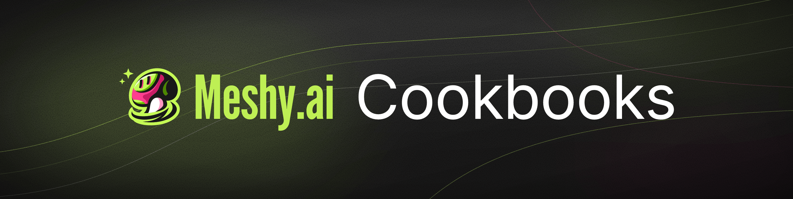

Short, runnable recipes for the [Meshy API](https://docs.meshy.ai). Each one takes you from an API key to a model file you can use, in one command, in Python or TypeScript.

| Cookbook | What you get |
|---|---|
| [01 · Concept art to game character](examples/01-image-to-3d-character/) | A textured, PBR character GLB from one piece of concept art, ready for Blender |
| [02 · Text prompt to hero prop](examples/02-text-to-hero-prop/) | A hero prop GLB from one sentence, with Ultra 4K geometry, 4K PBR textures and the concept image |
| [03 · Product photos to a 4K product model](examples/03-photos-to-product-model/) | A life-size GLB and USDZ with Ultra 2K geometry and 4K PBR textures from three product photos, plus four renders |
| [04 · Voxel sketch to low-poly game prop](examples/04-image-to-low-poly-prop/) | A low-poly GLB at a face count you choose, from one blocky concept image, in seconds |

## How the repo is laid out

- `examples/NN-name/` holds one recipe with a README, a sample `input/` when the recipe starts from a file, and both a `python/` and a `typescript/` entry point that do the same thing.
- `shared/python/meshy.py` and `shared/typescript/meshy.ts` are the small API clients: create a task, poll it, download the result. Copy the one for your language into your own project.

## Run one

Live API runs require a Meshy plan with API access: Pro, Premium, Ultra, Studio, or Enterprise. Create an [API key](https://www.meshy.ai/developers/), then check your plan and credit balance in [subscription settings](https://www.meshy.ai/settings/subscription). These cookbooks consumed approximately 5–44 credits per complete run in our recorded examples; consult [current API pricing](https://docs.meshy.ai/en/api/pricing) before running.

Open the cookbook’s README and follow “Run it.”

## License

MIT. See [LICENSE](LICENSE).
